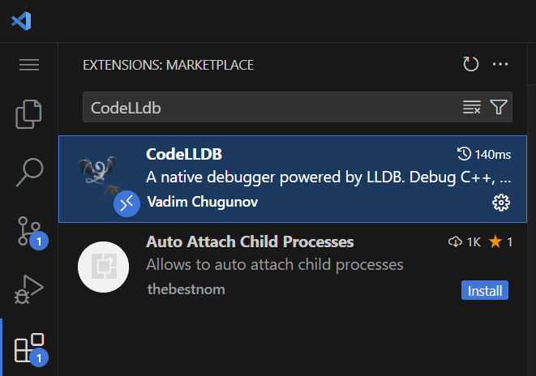
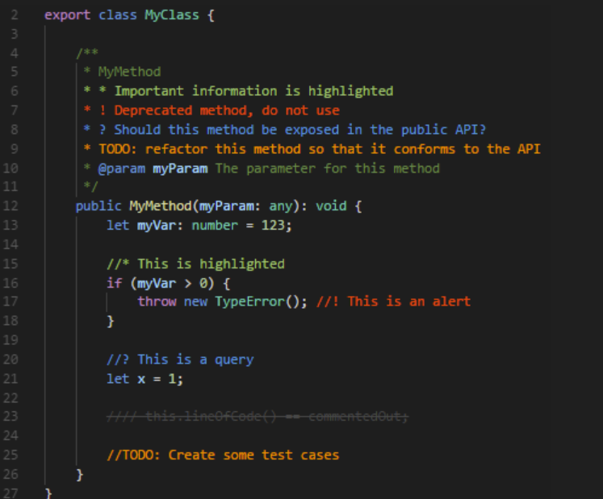
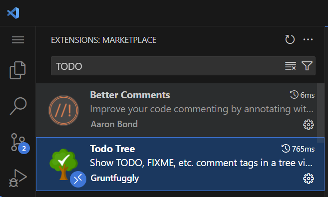
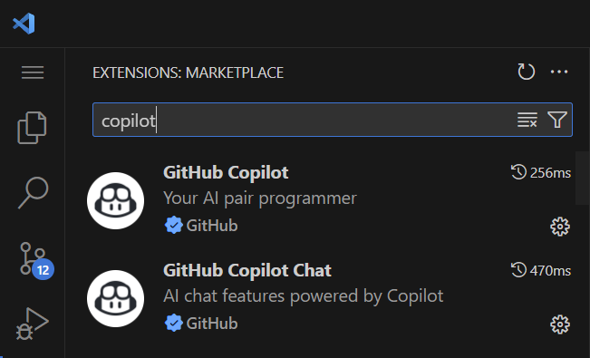

# 1 OS和编译器环境
本实验目前最高使用的`C++`标准是`C++20`, 所以需要使用`g++`或者`clang++`进行编译, 因此只要是支持`C++20`的编译器都可以. 我这里使用的操作系统是`kali linux`, 其和`Ubuntu`一样, 都是基于`Debian`, 且都使用`apt`作为系统包管理工具, 所以你使用`Ubuntu`或者`Debian`执行我之后的安装指令肯定也没有什么问题。

> 我使用`WSL2`的`kali linux`作为开发环境, `WSL2`相关内容可以参考[WSL入门到入土](https://zhuanlan.zhihu.com/p/682583573)
> 经个人验证, `WSL2`的`kali-linux`和`Ubuntu 22.04`均能正常完成本实验

## 1.1 编译器安装
```bash
sudo apt install -y gcc
sudo apt install -y g++
```
经测试, 只要支持`C++20`的编译器均可以正常构建本项目, 我测试通过的编译器版本包括:
- `g++-11/12/13/14/15`
- `clang++-16/17/18/19`

## 1.2 语言服务器
本实验推荐使用`clangd`作为语言服务器, `clangd`是一个`C/C++`语言服务器, 其可以提供代码补全、代码跳转、代码高亮等功能。


```bash
# Ubuntu/Debian/Kali
sudo apt update
sudo apt install -y clangd

# Arch Linux / Manjaro
sudo pacman -S clang # 安装的是最新版本的 clang 包，clangd 自动包含在其中。

# Fedora / CentOS / RHEL
sudo dnf install clang-tools-extra # langd 在 clang-tools-extra 包中

# openSUSE
sudo zypper install clang-tools
```

# 2 项目管理工具
## 2.1 Xmake
### 2.1.1 安装
本实验使用`Xmake`作为项目管理工具, `Xmake`是一个`C/C++`项目管理工具, 其可以看做`Make`+`CMake`+`vcpkg`的集合, 包括构建、依赖管理和项目运行等功能。

**安装Xmake**
```bash
curl -fsSL https://xmake.io/shget.text | bash
```

`Xmake`官网参考: https://xmake.io/#/getting_started

### 2.1.2 Xmake语法简介
`Xmake`使用`Lua`作为脚本语言，其语法简单易学，支持`C/C++`的依赖管理、构建、运行等功能。以下是一些基本的内置函数：

- **项目配置**：通过 `add_rules` 添加规则，如添加 C++11 支持。
- **目标定义**：使用 `target` 定义构建目标，包括可执行文件或库。
- **源文件指定**：通过 `set_sources` 指定源代码文件。
- **依赖管理**：定义项目时使用`add_requires`添加依赖, 定义目标时用 `add_deps` 声明本地依赖的目标, 使用 `add_packages` 添加第三方包依赖。
- **宏定义与包含路径**：分别通过 `add_defines` 和 `add_includedirs` 设置。

这里说起来比较抽象, 直接看一个示例：

```lua
-- 定义项目
set_project("toni-lsm")
set_version("0.0.1")
set_languages("c++20")

add_rules("mode.debug", "mode.release")
add_requires("gtest") -- 添加gtest依赖
add_requires("muduo") -- 添加Muduo库

target("utils")
    set_kind("static")  -- 生成静态库
    add_files("src/utils/*.cpp") -- 指定源代码文件
    add_includedirs("include", {public = true})

target("example")
    set_kind("binary")  -- 生成可执行文件
    add_files("example/main.cpp") -- 指定源代码文件
    add_deps("utils") -- 声明依赖目标
    add_includedirs("include", {public = true})
    set_targetdir("$(buildir)/bin")
    add_packages("gtest")  -- 添加gtest包
```

常用的

以上是 `Xmake` 的基本语法概览，更多细节可以参考官方文档: https://xmake.io/#/getting_started

## 2.2 (可选)vcpkg安装
正常情况下, `Xmake`已经足够本项目的构建需求。但是可能存在系统依赖不兼容导致`Xmake`无法从`xrepo`拉取依赖的情况, 此时建议使用`vcpkg`进行第三方的依赖管理。

`vcpkg`是一个跨平台依赖管理工具, 其可以自动下载、编译和安装`C/C++`依赖库。虽然`Xmake`自带一个依赖管理库, 但上面的库还是比较少, 作为补充, 我们可以再安装`vcpkg`, 这使得我们可以使用`vcpkg`来安装更多`Xmake`没有的依赖库。

`vcpkg`这里不过多介绍, 可以直接看我另一篇文章: https://zhuanlan.zhihu.com/p/849150169

# 3 VSCode配置
## 3.1 代码智能提示和跳转
这里使用`clangd`作为语言服务器, 我们之前已经安装了`clangd`, 现在只需要在`VSCode`中安装`clangd`插件即可:


## 3.2 集成Xmake
`VScode`中支持`Xmake`项目管理工具, 我们可以安装`Xmake`插件, 使得在`VSCode`中可以更方便的使用`Xmake`项目管理工具:


这里有一点需要说明, 如果你安装了`Xmake`插件, 但是在调试时卡死不懂, 建议禁用`Code Runner`和`C/C++ Runner`两个插件, 如果还行不将`CMake`插件也一起禁用了:


如果你的`Xmake`在调试时进入的是`gdb`的页面, 请在设置中将`Debug Config Type`设置为`lldb`:


当然你需要先安装`CodeLLdb`插件:



## 3.3 代码高亮
如果你经常用`C++`开发, 那么你可能经常会遇到第三方包导致代码高亮跳转失效的问题:


这是因为语言服务器找不到第三方包的头文件, 由于我们使用的语言服务器是`clangd`, 我们可以在项目根目录中添加`.clangd`配置文件, 让`clangd`知道我们的第三方包头文件的位置:
```yaml
CompileFlags:            # 编译标志部分
  Add:
    - "-std=c++20"      # 添加 C++17 支持
    - "-isystem/home/toni/proj/vcpkg/installed/x64-linux/include" # 包含头文件, 绝对路径
    - "-isystem/home/toni/.xmake/packages/m/muduo/2022.11.01/e9382a25649e4e43bf04f01f925d9c2f/include" # 包含头文件, 绝对路径
```

这样一来之前的告警就不复存在了

## 3.4 其他实用插件
### 3.4.1 Better Comments && TodoTree
`Better Comments`是一个`VSCode`插件, 它可以提供代码注释高亮和语法高亮功能, 使得代码更加易读。比如像`TODO`, `!`这样的符号:



当我们实现一个功能但其后续需要更新时, 我们可以在代码中添加`TODO`注释, 以便后续更新时更醒目。

`TodoTree`则会在侧边栏展开我们标记了`TODO`的注释的位置



### 3.4.2 AI插件
如果你有钱, 直接用`Cusor`, `Windsurf`, 他们的体验更好

如果和我一样不够钱, 那么你可以使用`通义灵码`, `Cline`或者`GitHub Copilot`:




