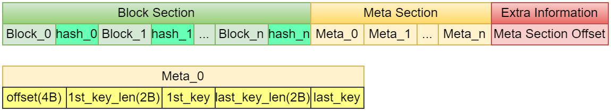

# Lab 3.4 BlockMeta
# 1 概述
让我们再次回顾`SST`的结构:



可以看到, `SST`中有一个`Meta Section`, 它是一个数组, 数组中的每一个元素对应一个`Block`的元信息, 这些元信息包括:
- 该`Block`在`SST`中的偏移量
- 该`Block`的第一个`key`和最后一个`key`的元数据

在`SST`构建完成后, 其文件持久化在文件系统中, 但`Meta Section`会被加载到内存中并解码为控制结构, 因为没有`Meta Section`的元数据, 我们是没法对`SST`按照`Block`进行索引的。在`Toni-LSM`中, 这里的元数据在内存中用类`BlockMeta`来表示, 其定义为:
```cpp
class BlockMeta {
  friend class BlockMetaTest;

public:
  size_t offset;         // 块在文件中的偏移量
  std::string first_key; // 块的第一个key
  std::string last_key;  // 块的最后一个key
  static void encode_meta_to_slice(std::vector<BlockMeta> &meta_entries,
                                   std::vector<uint8_t> &metadata);
  static std::vector<BlockMeta>
  decode_meta_from_slice(const std::vector<uint8_t> &metadata);
  BlockMeta();
  BlockMeta(size_t offset, const std::string &first_key,
            const std::string &last_key);
};
```

这里的每一个`BlockMeta`对应一个`Block`的元数据, 包含了我们之前介绍的编码方式的基础数据结构。

# 2 代码实现
你需要修改的代码文件为:
- `src/block/blockmeta.cpp`
- `include/block/blockmeta.h` (Optional)

## 2.1 编码函数
你需要实现将内存中的元信息编码到二进制数组的函数:
```cpp
void BlockMeta::encode_meta_to_slice(std::vector<BlockMeta> &meta_entries,
                                     std::vector<uint8_t> &metadata) {
  // TODO: Lab 3.4 将内存中所有`Blcok`的元数据编码为二进制字节数组
  // ? 输入输出都由参数中的引用给定, 你不需要自己创建`vector`
}
```

## 2.2 解码函数
你需要实现将二进制数组解码到内存中的函数:
```cpp
std::vector<BlockMeta>
BlockMeta::decode_meta_from_slice(const std::vector<uint8_t> &metadata) {
  // TODO: Lab 3.4 将二进制字节数组解码为内存中的`Blcok`元数据
  return {};
}
```

> 这里的编码解码都是以代表整个`SST`元信息的`vector`数组进行的, 上层组件并不要求你实现单个`Block`的编解码函数, 但需要你可以选择实现单个`Block`的编解码函数作为辅助函数

# 3 测试
测试代码在`test/test_blockmeta.cpp`中, 正常情况下, 完成本小节`Lab`后你应该可以通过所有的测试:
```bash
✗ xmake
✗ xmake run test_blockmeta
[==========] Running 6 tests from 1 test suite.
[----------] Global test environment set-up.
[----------] 6 tests from BlockMetaTest
[ RUN      ] BlockMetaTest.BasicEncodeDecodeTest
[       OK ] BlockMetaTest.BasicEncodeDecodeTest (0 ms)
[ RUN      ] BlockMetaTest.EmptyMetaTest
[       OK ] BlockMetaTest.EmptyMetaTest (0 ms)
[ RUN      ] BlockMetaTest.SpecialCharTest
[       OK ] BlockMetaTest.SpecialCharTest (0 ms)
[ RUN      ] BlockMetaTest.ErrorHandlingTest
[       OK ] BlockMetaTest.ErrorHandlingTest (0 ms)
[ RUN      ] BlockMetaTest.LargeDataTest
[       OK ] BlockMetaTest.LargeDataTest (0 ms)
[ RUN      ] BlockMetaTest.OrderTest
[       OK ] BlockMetaTest.OrderTest (0 ms)
[----------] 6 tests from BlockMetaTest (0 ms total)

[----------] Global test environment tear-down
[==========] 6 tests from 1 test suite ran. (1 ms total)
[  PASSED  ] 6 tests.
```

# 4 思考
我们实现了`Block`类的元信息`BlcokMeta`, 现在可以思考一下, `BlcokMeta`如何被上层使用? 其如何加速查询?

